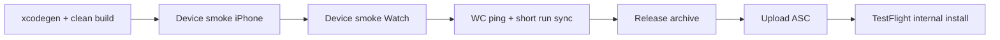

# Native Monday readiness plan (iPhone + Watch)

**Created:** 2026-05-02 (Friday night deadline: Monday morning)  
**Goal:** Kinetix **iPhone + Apple Watch** builds are **release-signed**, **physically smoke-tested**, and **in internal TestFlight** (or upload submitted and processing) with **no undocumented blockers**.

**Canonical checklists (do not rewrite; execute in order):**
- [`KINETIX_IOS_WATCH_TESTFLIGHT_CHECKLIST.md`](KINETIX_IOS_WATCH_TESTFLIGHT_CHECKLIST.md) — signing, archive, upload, TestFlight rows.
- [`../kinetix/KX-SMOKE-013-real-device-smoke.md`](../kinetix/KX-SMOKE-013-real-device-smoke.md) — physical iPhone + Watch UX and caps.
- [`../kinetix/KX-WATCH-024-watch-connectivity-contract.md`](../kinetix/KX-WATCH-024-watch-connectivity-contract.md) + [`../testing/WATCH_CONNECTIVITY_TROUBLESHOOTING.md`](../testing/WATCH_CONNECTIVITY_TROUBLESHOOTING.md) — WC ping/pong on **real** hardware only.

**Scope freeze for this weekend:** TestFlight internal beta per checklist **section 3 scope** (no new product features, no Garmin, no subscription/ads focus). Triage **P0 only**: crash, data loss, broken install, blank screen, WC completely dead without messaging.

---

## Definition of done (Monday morning)

| # | Criterion |
|---|-----------|
| 1 | `main` (or agreed release branch) builds **KinetixPhone** + embedded **KinetixWatch** in **Release** on Mac with team **AWJBX83Y4X** and IDs in the TestFlight checklist. |
| 2 | **Archive** validates; **upload** to App Store Connect completes or is **Waiting for Review** / **Processing** with a known build number. |
| 3 | **Internal TestFlight** group has the build; at least one **iPhone** install + launch **PASS**. |
| 4 | **Paired Watch:** companion installs; launch **PASS**; **start / stop / save** run **PASS** or limitation is **written** in evidence. |
| 5 | **WC diagnostic:** Settings **Ping Watch** yields pong when reachable, or failure matches troubleshooting doc (logged, not silent). |
| 6 | [`PHASE4_RELEASE_EVIDENCE.md`](../PHASE4_RELEASE_EVIDENCE.md) (or a dated addendum) has **PASS/FAIL** rows for native + link to build. |

---

## Critical path (shortest sequence)

Everything else (web, Stripe, SSO matrix) is **parallel** or **post-beta** unless it blocks native auth/sync.

---

## Timeboxed schedule

### Friday night (2-4 hours)

| Step | Action |
|------|--------|
| 1 | `git pull` on `main`; confirm at or past native fixes (e.g. WC diagnostics, tab bar clearance). |
| 2 | `cd watchos && xcodegen generate` — **required** after any `project.yml` or new Swift under Watch. |
| 3 | Xcode: **Product → Clean Build Folder**; build **KinetixPhone** for a **real iPhone**; fix **compile errors only**. |
| 4 | Quick launch on iPhone: Home, Settings tail, no immediate crash. |
| 5 | If blocked on signing/ASC: stop and fix **tonight** (weekend admin delays are common). |

### Saturday (main push)

| Step | Action |
|------|--------|
| 1 | Full **KX-SMOKE-013** iPhone checklist on physical device. |
| 2 | Full **KX-SMOKE-013** Watch checklist; History/KPS caps; coach fallback string. |
| 3 | **TestFlight checklist** sections 8-9 (iPhone + Watch rows); tick in-repo or in evidence doc. |
| 4 | **KX-WATCH-024:** ping/pong with both apps awake; note reachability vs application-context behavior. |
| 5 | Fix **P0** regressions; avoid feature creep. |
| 6 | **Release** archive **KinetixPhone**; Validate; **Upload**; capture build number. |

### Sunday (buffer + polish)

| Step | Action |
|------|--------|
| 1 | ASC: wait for processing; fix **missing compliance**, export notes, encryption flags if prompted. |
| 2 | Second pass on Watch **install from iPhone** path (Watch app → Install). |
| 3 | Re-run **invalid run** / permission denial paths (checklist: no crash). |
| 4 | App Review traps (checklist §12): purpose strings, no broken companion, no ads/paywall in beta scope. |

### Monday morning (1-2 hours)

| Step | Action |
|------|--------|
| 1 | Internal testers install from TestFlight; **smoke: launch + one screen**. |
| 2 | If upload failed Sunday: **morning re-upload** is still a win if processing completes same day. |
| 3 | Post **build number + PASS/FAIL** to Slack product channel; file blockers with **owner + ETA**. |

---

## Parallel tracks (non-blocking for native binary)

- **Web / API:** `pnpm verify:kinetix-parity` on Mac when touching shared contracts; not required to complete every Phase 4 interactive row before **internal** native beta.
- **Infisical:** `pnpm infisical:list-keys` from `products/Kinetix` if native build needs env parity sanity (no secret values in chat).
- **CI:** Maestro / native-ci green on `main` is a **confidence** signal, not a substitute for **device** smoke.

---

## Risks and mitigations

| Risk | Mitigation |
|------|------------|
| ASC processing slow | Upload **Saturday**; keep Sunday buffer; use **internal** group first. |
| Watch not installing | Follow [`../../watchos/WATCH_INSTALL_FIX.md`](../../watchos/WATCH_INSTALL_FIX.md) + README embedding rules. |
| WC "paired not reachable" | Expected when phone asleep; document; rely on application context for templates/weight; ping only when both awake. |
| Simulator-only validation | **Insufficient** for Monday claim; mark **BLOCKED_ON_PHYSICAL_WATCH** if no hardware time. |
| Scope creep | **Freeze** features; only P0 fixes until TF is up. |

---

## Stop conditions (do not burn weekend on wrong work)

- Need **Apple Developer admin** (certs, identifiers, agreements): document and escalate immediately.
- **Archive** fails on entitlement / HealthKit: fix signing first, not app logic.
- Repeated **non-repro** bugs: capture sysdiagnose / video, ship with **known limitation** in evidence rather than missing Monday binary.

---

## After Monday

- Merge any hotfix branch with **minimal** diff.
- Update [`../PROJECT_PLAN.md`](../PROJECT_PLAN.md) **Current focus** and [`../KINETIX_SCOPE_CLOSURE.md`](../KINETIX_SCOPE_CLOSURE.md) if native lane status changes.
- Schedule **external** TestFlight or App Store only after internal sign-off and checklist §12 review.
